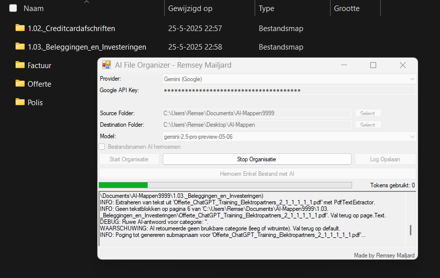

# AI File Organizer 🚀

**AI File Organizer** is een slimme Windows-applicatie die jouw documenten automatisch organiseert en hernoemt met behulp van krachtige AI-modellen (Gemini, OpenAI, Azure OpenAI).  Selecteer eenvoudig je bronmap en doelmap, kies een AI-provider, en de applicatie doet het werk voor je! 

 

Deze applicatie scant, analyseert en organiseert je bestanden (PDF, DOCX, TXT, MD) automatisch in logische categorieën en submappen – volledig op basis van de inhoud. Daarnaast doet de app slimme suggesties voor duidelijke bestandsnamen, zodat je digitale archief altijd netjes blijft.
Met AI File Organizer bespaar je tijd, houd je overzicht en regelt AI al het organiseerwerk voor je.

**Voor wie?**  
Voor iedereen die snel en moeiteloos orde wil scheppen in een grote verzameling digitale documenten – van thuisadministratie tot kleine bedrijven en zzp’ers.
> **Let op:** Zorg dat billing/tegoed geactiveerd is bij je AI-provider (Gemini, OpenAI of Azure OpenAI).

## ⚡ Alleen een mappen generator nodig?

Wil je **niet de volledige Windows-applicatie**, maar gewoon snel een persoonlijke mappenstructuur aanmaken?  
Gebruik dan de losse **Persoonlijke Mappen Generator**:

➡️ **[Download PersoonlijkeMappenStructuurGenerator.exe](https://github.com/RemseyMailjard/AI-FileOrganizer/raw/master/PersoonlijkeMappenGenerator/PersoonlijkeMappenStructuurGenerator.exe)**

1. Klik op de bovenstaande link om het EXE-bestand direct te downloaden.
2. Open het gedownloade bestand en volg de instructies om je mappenstructuur te genereren op je eigen computer.

> ℹ️ Geen installatie nodig — direct starten!

## 📋 Functies

- **AI-gestuurde classificatie:** Bestanden worden automatisch ingedeeld in logische (sub)categorieën op basis van hun inhoud.
- **AI-voorstellen voor submappen en bestandsnamen:** Ontvang slimme suggesties voor een georganiseerde mappenstructuur en duidelijke bestandsnamen.
- **Brede AI-ondersteuning:** Werkt met Gemini (Google), OpenAI, en Azure OpenAI.
- **Gebruiksvriendelijke interface:** Intuïtief ontwerp met drag & drop functionaliteit.
- **Transparant proces:** Live voortgangsupdates en uitgebreide logging.
- **Flexibel:** Mogelijkheid om het organisatieproces op elk moment te annuleren.

---
## 📌 Vereisten

- Windows 10 of hoger
- .NET Framework 4.8 (de installer controleert dit en biedt installatie automatisch aan indien nodig)
- Een geldige API-key voor Gemini (Google), OpenAI, of Azure OpenAI
- **Billing (facturatie) moet zijn ingeschakeld** bij je gekozen AI-provider.
  > ⚠️ **Belangrijk:** De AI-modellen die deze tool gebruikt (Gemini, OpenAI, etc.) brengen kosten in rekening bij de providers per gebruik (tokens). Zonder actieve facturatie zal de API-toegang niet werken, zelfs niet voor eventuele 'gratis' limieten of proefperiodes.
- Actieve internetverbinding

---

## 📦 Installatie

1.  Download de nieuwste installer uit de [`installer`](installer) map:
    [AIFileOrganizerSetup.exe](Installer/AIFileOrganizerSetup.exe)
2.  Dubbelklik op het `AIFileOrganizerSetup.exe` bestand en volg de stappen in de installatie-wizard.
3.  Start de applicatie via de snelkoppeling op je bureaublad of via het Startmenu.

> **Let op:** Tijdens de installatie kan Windows om administratorrechten vragen om de software correct te installeren.

## 🗝️ API-key instellen

Voordat je kunt beginnen, moet je je AI-provider configureren:

1.  Start **AI File Organizer**.
2.  Ga naar het instellingenscherm (vaak aangegeven met een tandwiel-icoon of direct zichtbaar bij de eerste start).
3.  Vul je API-key in voor de gewenste service (Gemini, OpenAI, of Azure OpenAI).
4.  **Voor Azure OpenAI:** Vul ook het specifieke `Endpoint` en de `Deployment Name` (modelnaam) in die je in Azure hebt geconfigureerd.
5.  Selecteer het gewenste AI-model uit de lijst (indien van toepassing voor de gekozen provider).
6.  Sla de instellingen op.

> **Let op:**
> Zorg ervoor dat **billing/tegoed geactiveerd is** bij je AI-provider (zoals Google Cloud voor Gemini, of OpenAI direct). Zonder dit werken de API-calls niet.
>
> Voor gedetailleerde, stapsgewijze instructies (inclusief voorbeelden) over het verkrijgen en configureren van je API-key, raadpleeg:
> [installatie-informatie.txt](installer/installatie-informatie.txt)

---

## ⚡ Gebruik

Organiseer je bestanden in een paar simpele stappen:

1.  **Selecteer Bronmap:** Klik op "Bladeren..." en kies de map met de bestanden die je wilt organiseren.
2.  **Kies Doelmap:** Klik op "Bladeren..." en selecteer een (lege of nieuwe) map waar de georganiseerde bestanden en mappen moeten komen.
3.  **(Optioneel) AI Hernoemen:** Vink de optie aan als je wilt dat de AI ook suggesties doet voor nieuwe bestandsnamen.
4.  Klik op **Start** en de AI File Organizer begint met het analyseren en verplaatsen van je bestanden.
5.  Volg de voortgang in het logvenster. Hier zie je welke bestanden worden verwerkt en welke mappen worden aangemaakt.
6.  Na afloop kun je het logboek opslaan als een `.txt`-bestand voor naslag.

---

## 📂 Ondersteunde bestandstypen

Momenteel worden de volgende bestandstypen ondersteund voor inhoudsanalyse:

- PDF (`.pdf`)
- Word-documenten (`.docx`)
- Tekstbestanden (`.txt`, `.md`)

> 💡 Suggesties voor ondersteuning van andere bestandstypen zijn welkom! Maak hiervoor een [Issue aan op GitHub](#-support--feedback).

---

## 🗃️ Mapcategorieën (Voorbeelden)

De AI analyseert de inhoud van je bestanden en stelt een logische mappenstructuur voor. Voorbeelden van hoofdmappen die automatisch kunnen worden aangemaakt zijn:

- Financiën (bijv. facturen, bankafschriften)
- Belastingen (bijv. aangiftes, specificaties)
- Verzekeringen (bijv. polissen, correspondentie)
- Woning (bijv. huurcontract, hypotheekdocumenten, VvE)
- Gezondheid & Medisch (bijv. doktersrekeningen, uitslagen)
- Familie & Kinderen (bijv. schoolrapporten, geboorteaktes)
- Voertuigen (bijv. kentekenbewijs, verzekering, onderhoud)
- Persoonlijke documenten (bijv. identiteitsbewijzen, diploma's)
- Hobbies & Interesses (bijv. artikelen, projectnotities)
- Carrière / Werk (bijv. contracten, sollicitaties, certificaten)
- Bedrijfsadministratie (indien relevant voor de documenten)
- Reizen & Vakanties (bijv. boekingen, tickets)
- Overig (voor bestanden die niet direct in een specifieke categorie passen)

De applicatie is ontworpen om **automatisch relevante submappen** te creëren als de AI voldoende specifieke details in de documenten detecteert, voor een nog fijnmazigere organisatie.

---

## 📑 Projectstructuur (voor ontwikkelaars)

Een overzicht van de mappen in deze repository:

- `installer/` — Bevat de setup (AIFileOrganizerSetup.exe), licentie, en aanvullende informatiebestanden.
- `bin/Release/` — Bevat de gecompileerde, uitvoerbare bestanden van de applicatie.
- `src/` — Bevat de volledige C# broncode van de AI File Organizer.
- `README.md` — Dit bestand.
- `LICENSE.txt` — De MIT-licentietekst.

---

## 🛠️ Gebruikte componenten & technologieën

Deze applicatie maakt gebruik van de volgende belangrijke libraries en API's:

- **PdfPig:** Voor het extraheren van tekst uit PDF-bestanden.
- **DocumentFormat.OpenXml (Open XML SDK):** Voor het lezen van Microsoft Word (`.docx`) bestanden.
- **Microsoft.WindowsAPICodePack-Shell:** Voor moderne Windows-dialogen (zoals mapselectie).
- **AI API's:**
    - Google Gemini API Client Libraries
    - OpenAI API Client Libraries
    - Azure.AI.OpenAI Client Libraries
- **Newtonsoft.Json:** Voor het verwerken van JSON-data (vaak gebruikt in API-communicatie).
- **.NET Framework 4.8 & Windows Forms:** Voor de applicatie-interface en basisfunctionaliteit.

---

## 📞 Support & Feedback

Heb je vragen, ideeën voor nieuwe functies, of een bug gevonden? We horen het graag!

- **Maak een Issue aan op GitHub:** Dit is de beste plek voor bug reports en feature requests.
  [Ga naar de Issues Pagina](https://github.com/RemseyMailjard/PersoonlijkeMappenGenerator/issues)
- **LinkedIn:** Neem contact op met [Remsey Mailjard](https://www.linkedin.com/in/remseymailjard/)
- **Website:** Bezoek [remsey.nl](https://www.remsey.nl) voor meer projecten en informatie.

---

## 📄 Licentie

Dit project is open source en beschikbaar onder de [MIT-licentie](installer/LICENSE.txt). Dit betekent dat je de software vrij mag gebruiken, aanpassen en verspreiden, onder de voorwaarden van de licentie.

---

Veel plezier met het organiseren van je bestanden! 🎉

Vind je deze tool handig en wil je het project ondersteunen? Overweeg een ster ⭐ te geven op GitHub!

© 2025 Remsey Mailjard | AI File Organizer
